# WEEK 1 LEARNINGS

## Day 1

On day 1 i explored the system’s Node.js environment and NVM setup.

### System Exploration
- Documented OS version, active shell, Node binary path, NPM global path, and PATH entries related to Node/NPM.
- Verified Node and NPM installation details.

### NVM Setup
- Installed NVM and configured the environment.
- Switched between Node LTS and Latest versions to confirm proper version management.

### Introspection Script
Created `introspect.js` to output:
- OS details  
- Architecture and CPU info  
- Memory and uptime  
- Logged-in user  
- Node binary location

### Stream vs Buffer Test
- Generated a 50MB+ test file.
- Compared `fs.readFile` (Buffer) vs `fs.createReadStream` (Stream).
- Measured execution time and memory usage for both approaches.

### Screenshots
- ***OS Version***  
  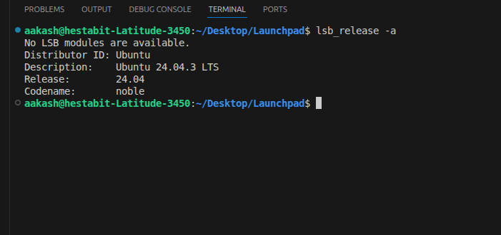

- ***Current Shell***  
  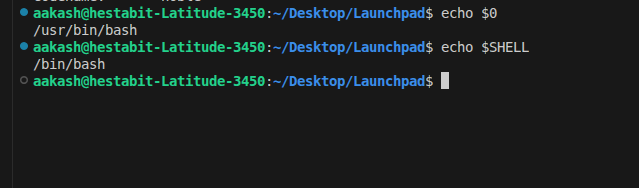

- ***Node Binary Path***  
  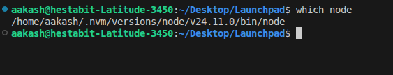

- ***NPM Global Path*** 
  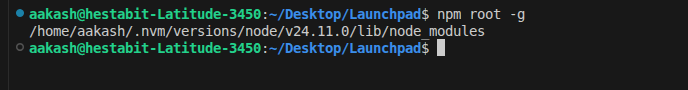

- ***Node/NPM in PATH***  
  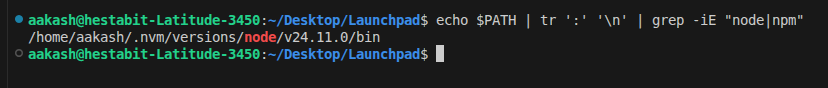

- ***NVM Installation***  
  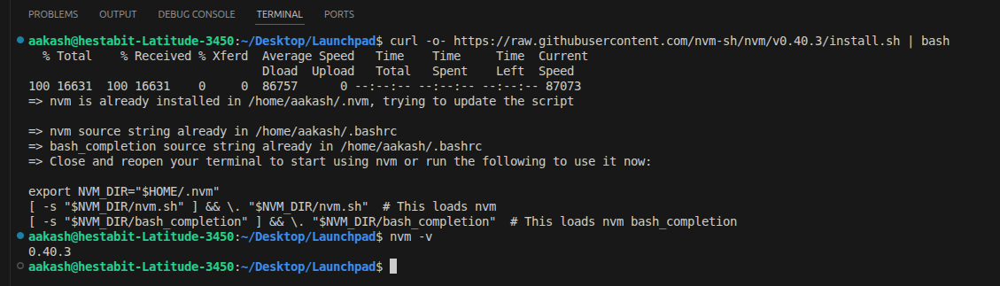

- ***Switching Node Versions***  
  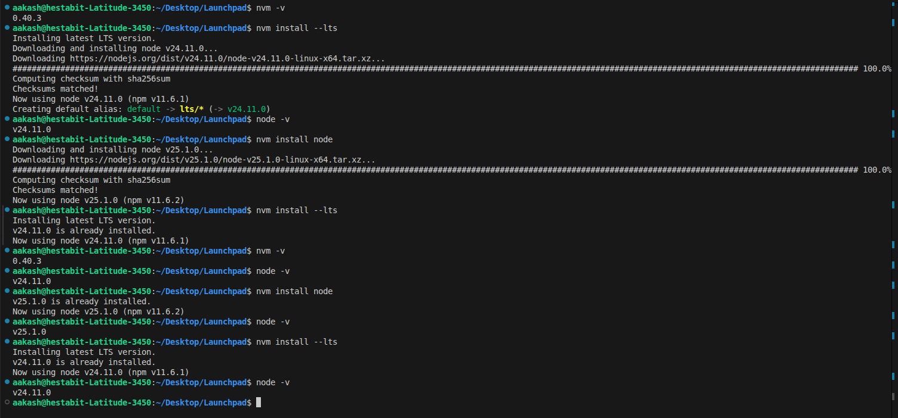

## Day 2

On day 2 i built a word-stats CLI tool and tested its performance with concurrency.

### Tasks

1. **Create a Big Corpus File**  
   - Generated a text file containing more than 200,000 words.

2. **Build CLI Command**  
   Used the following command to analyze word statistics:  
   `node wordstat.js --file corpus.txt --top 10 --minLen 5 --unique`

3. **CLI Output Includes**  
   - Total words  
   - Unique words  
   - Longest word  
   - Shortest word  
   - Top N repeated words  

4. **Add Concurrency**  
   - Split the input file into chunks  
   - Processed chunks in parallel using `Promise.all` or `worker_threads`

5. **Benchmarking**  
   - Tested concurrency levels: **1, 4, 8**  
   - Logged execution time for comparison

## Day 3

On Day 3 i worked with Git, focusing on commits, bisecting, merging, and conflict resolution.

### Tasks

1. **Create a Repository with 8+ Commits**  
   - Intentionally introduced a bug in commit 4.

2. **Use git bisect**  
   - Detected the faulty commit using `git bisect`.

3. **Fix the Bug and git revert**  
   - Fixed the bug and used `git revert` to undo only the buggy commit (not `git reset`).

4. **Use Stash Workflow**  
   - Ran `git stash`, followed by `git pull` and `git stash apply` to manage local changes.

5. **Merge Conflict Resolution**  
   - Using two clones of the repo, edited the same line in the same file.
   - Merged and resolved the conflict, keeping both changes from different branches.

### Screenshots

- **Terminal Logs for Merge Conflicts**  
  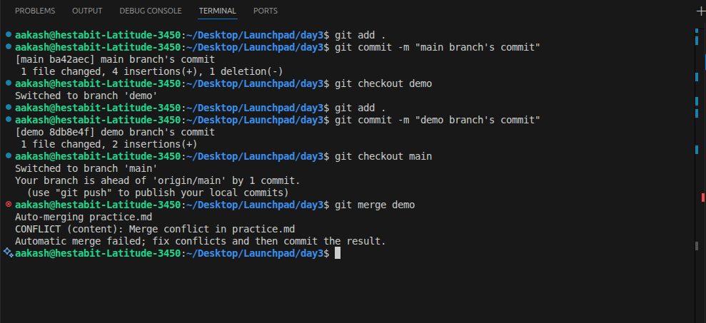

- **Screenshot of the Merge Conflict**  
  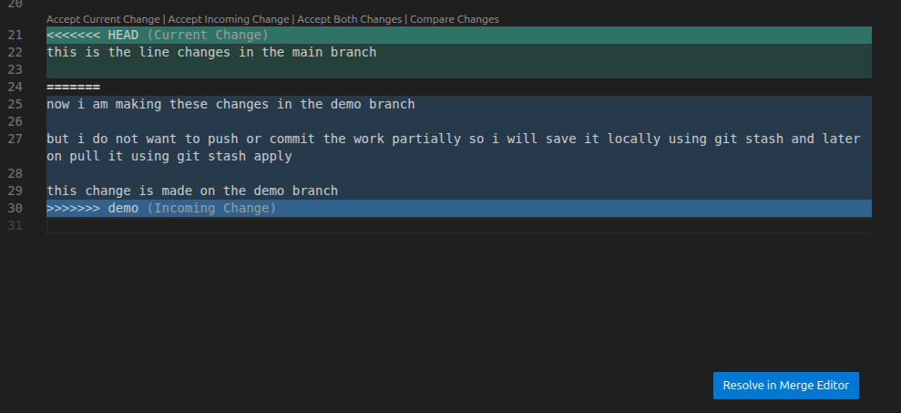

- **Resolving the Conflict**  
  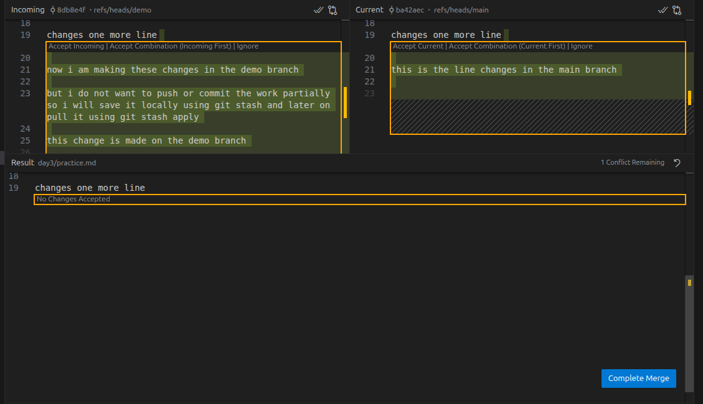

- **Resolved the Conflict, Keeping Both Changes**  
  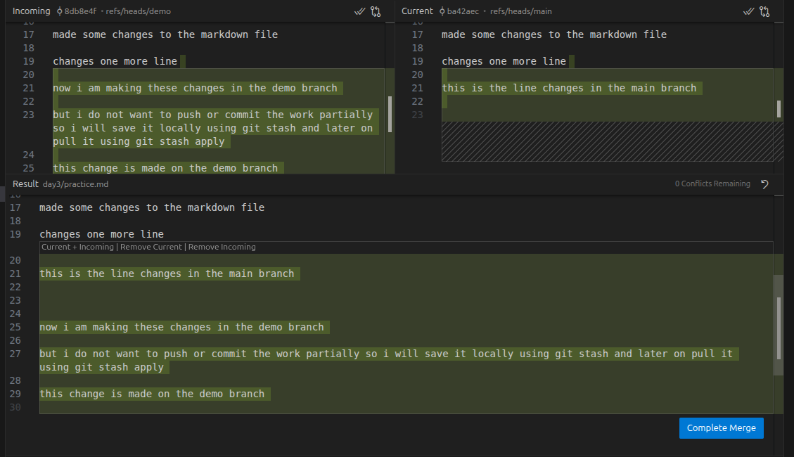

- **Graph of Branches After Merging**  
  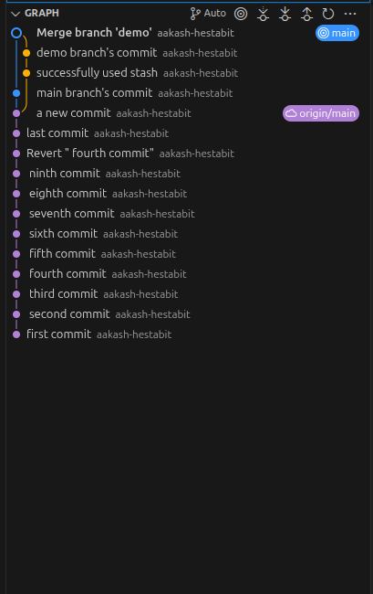

## Day 4

On day 4 i focused on network requests, DNS lookups, and building a Node HTTP server with caching and headers manipulation.

### What i did

1. **DNS Lookup and Traceroute**  
   - Performed `nslookup dummyjson.com` and `traceroute dummyjson.com`.

2. **Using CURL**  
   - Sent a GET request to fetch products from the dummy JSON API:  
     ```bash
     curl -v https://dummyjson.com/products?limit=5&skip=10
     ```

3. **Modifying Headers**  
   - Removed the **User-Agent** header and sent a **fake Authorization** header.  
   - Captured and compared the differences in the responses.

4. **Observe Caching**  
   - Extracted the **ETag** from the response and re-sent the request with `If-None-Match`.  
   - Verified a `304 (Not Modified)` response.

5. **Built a Node HTTP Server**  
   - Created endpoints:
     - `/echo`  returns request headers  
     - `/slow?ms=3000`  delays response by query parameter `ms`  
     - `/cache`  returns cache-related headers

### Screenshots


- **Request Sent to dummyjson.com Without Any Modification**  
  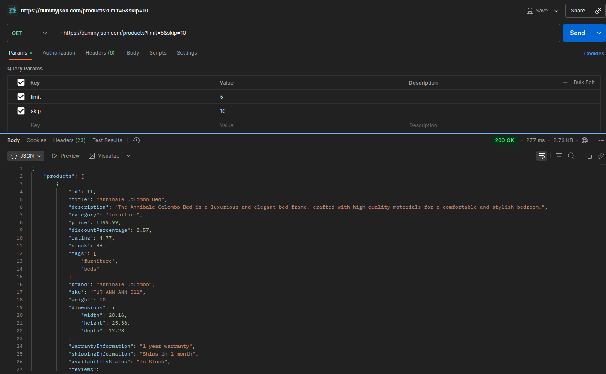

- **Request Sent to dummyjson After Removing the User-Agent**  
  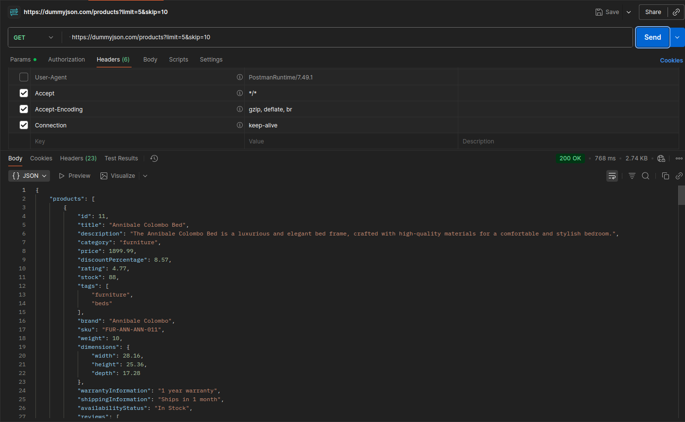

- **Request Sent to dummyjson with Fake Authorization Token**  
  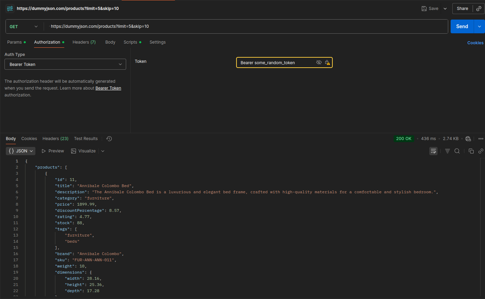

- **Comparison of Results from Fake Auth Token vs. Request Without User-Agent**  
  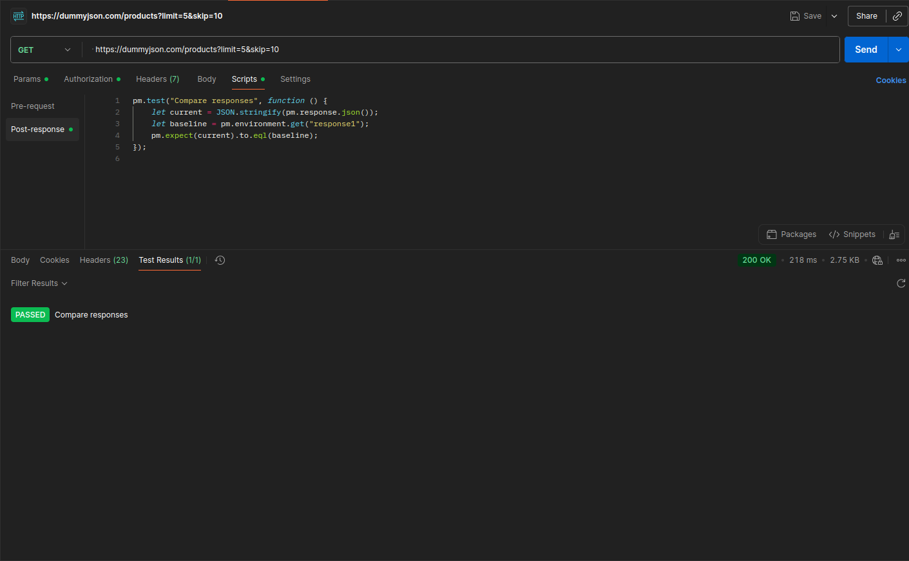

- **Sent the ETag to Check Caching and Got 304 Response**  
  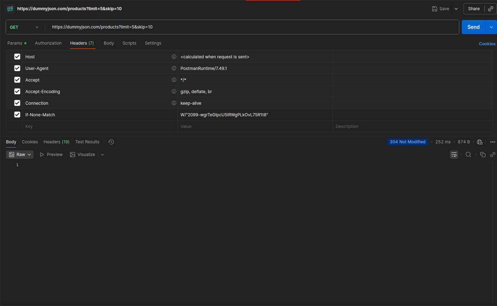

- **Node Server /echo Route**  
  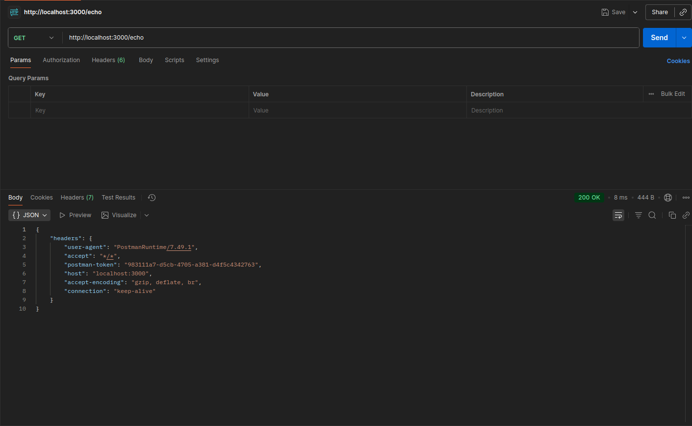

- **Node Server /slow Route Working as Expected**  
  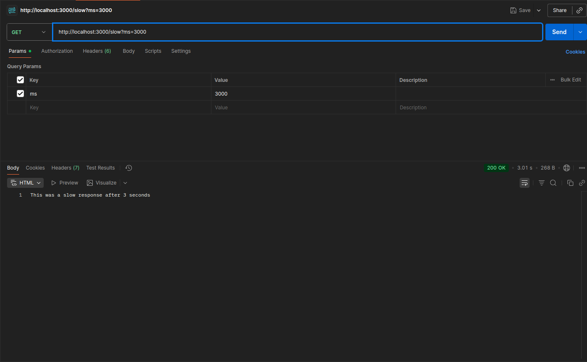

# Day 5

### Learnings:

1. **Create `validate.sh` script**:
   - Ensured the `src/` directory exists.
   - Validated `config.json` for correctness.
   - Appended logs with timestamps.

2. **Add ESLint + Prettier**:
   - Set up to block commits with bad formatting.

3. **Add Pre-commit hook using Husky**:
   - Ran linting and validation scripts on commit.
   - Rejected commit if validation or linting fails.

4. **Create Build Artifact**:
   - Packaged the source code and logs into a `.tgz` archive.
   - Generated a SHA checksum for the build.

5. **Schedule Script Execution**:
   - Used **cron** (Linux/Mac) or **Task Scheduler** (Windows) to automate script execution.

### Screenshots:

- **Husky Pre-commit Hook Failure**  
  When the pre-commit hook ran and failed due to the missing `config.json` file, it was logged and rejected:  
  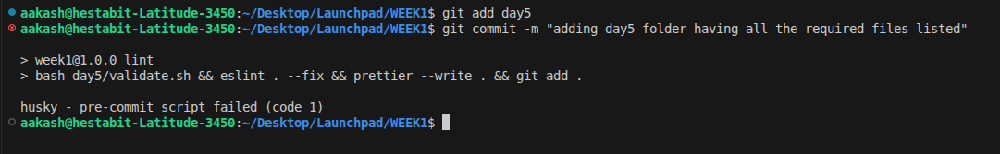
  
  Again when the linter ran after the validation was complete there was an unused variable so it prevented the commit 
  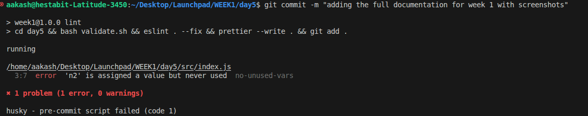


  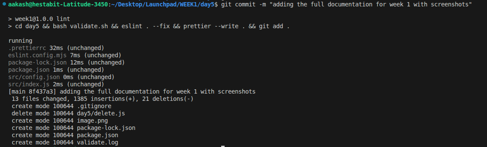